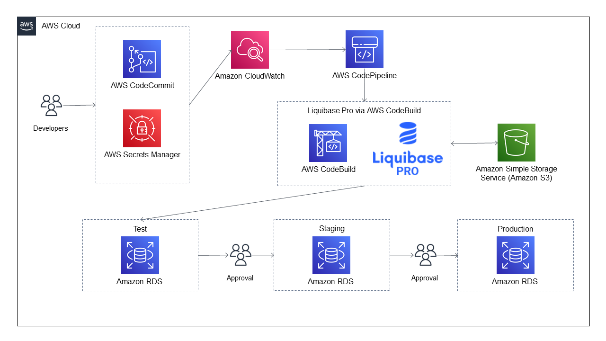

# Using Liquibase Pro with AWS CodePipeline and CodeBuild via AWS CloudFormation

Liquibase helps align database code changes with application code changes by using a version-based approach to quickly and easily update your database. This repository provides an AWS CloudFormation file along with the a .zip file that contains all artifacts required to demonstrate how Liquibase integrates with AWS. By simply installing the .zip in an S3 bucket and executing CloudFormation with provided YAML file, you will have a simple — yet powerful — example of how Liquibase integrates with your existing AWS infrastructure.



All of the instances referenced in the diagram above are created by the CloudFormation script.

## Setup Dependencies

### Upload codebuild-cs-demo-project.zip to an S3 bucket

All artifacts required for this exercise are contained in the .zip file. The contents are sourced from this repository. Note that the name of the .zip file is hard coded in the CloudFormation YAML. If you rename the .zip file, make sure to rename in your CloudFormation YAML file.

Create a new S3 Bucket and upload codebuild-cs-demo-project.zip. You will need the URI for the new S3 Bucket.

### Download and Install the Latest Version of Liquibase

[Download Liquibase](https://www.liquibase.org/download).

### Request a Liquibase Pro Trial License

[Get a Liquibase Pro License Key](https://www.liquibase.com/trial).
You will add this license key to later in this example to initiate advanced features and professional support free for 30 days.

### Identify a Database Subnet Group

Identify a Database Subnet Group in AWS RDS. It will correspond to a VPC. You will need the Database Subnet Group and VPC values later in this process.

### Choose a Username and Password for Your Databases

You will provide a username and password for each of your AWS RDS databases.


## Create a Stack Using the Provided CloudFormation Template.

- Using cloudformation-cs-demo-project.yml, navigate to CloudFormation in the AWS console.

- Select CloudFormation -> Stacks -> Create Stack.

- Select "Template is Ready".

- Select "Upload a template file".

- Select "Choose file" and select `cloudformation-cs-demo-project.yml`. 

- Enter the `Stack Name`.

- Enter the `ProjectName`. 

- Enter the `Name of S3 Bucket housing Liquibase project files`. NOTE: strip off the `s3://` URI preample and trailing slash. Just the bucket name.

- Enter the `LiquibaseProKey`.

- Select a VPC for your new stack.

- Enter the corresponding Database Subnet Group Name for the VPC used previously.

- Enter a Username and Password for each RDS database. The default username is `postgres`. 

- Select `Next`. 

- On the next screen, simply accept the defaults. 
For example, there is no reason to select a different IAM if your account has the appropriate permissions to create required resources.

- Select `Next`.

- Verify the settings, acknowledge the creation of required IAM resources, and select `Create Stack`.

## Visit CodePipeline and Approve Changes for Test and Production

Once CloudFormation completes the stack, CodePipeline will begin the process. Navigate to CodePipeline in the Console and select `Pipelines`. You will see a new Pipeline named `liquibase-pro-sample-CodePipeline`.

CodePipeline will start automatically and make the first deployment to the Test database. Select `Review` in the `Approval-Stage`. Repeat for the `Approval-Prod` stage.

## Next Steps

Now that you have completed your Liquibase Pro setup for AWS, you can quickly and safely make changes to your database using Liquibase. 

The easiest way to see this in action is to simply create a new SQL file in a `sqlfiles` directory in the repository. Simply clone the CodeCommit repository to your local machine. Then, create a directory named `sqlfiles`. Then add a file like the following to that directory. Finally, `git commit ... ` and `git push`. 

```
-- liquibase formatted sql 
--changeset AmyS:createTable_new_table_01
CREATE TABLE new_table_01 (
   ID int NOT NULL,
   NAME varchar(20) NULL,
   REGION varchar(20) NULL,
   MARKET varchar(20) NULL
)
```

You will then see a new CodePipeline execution triggered. 


